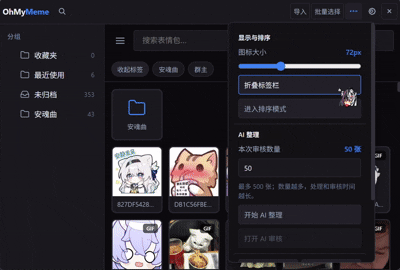

# 🚀 OhMyMeme-AI：让你的表情包“成精”

[](https://github.com/luckymolong/OhMyMeme-AI/releases)
[](LICENSE)
[](#直接部署懒人包)
[](#直接部署懒人包)
[](#从源码部署硬核玩家)
[](https://vuejs.org/)

这是基于 [OhMyMeme/OhMyMeme](https://github.com/OhMyMeme/OhMyMeme) 的衍生增强版。保留上游的核心能力，同时强化 AI 工作流、文件夹管理、跨端同步和拖拽体验。

## 📸 界面预览



## 💡 为什么选择 OhMyMeme-AI？

这是一个面向本地表情包管理的增强分支：AI 整理先给建议再由你确认；文件夹支持复制和剪切式移动；桌面端和 Android 端可共享 AI 元数据及分享包内容。所有修改都在本仓库维护，不会改动上游仓库。

## 🔗 认祖归宗

- 上游项目：[OhMyMeme/OhMyMeme](https://github.com/OhMyMeme/OhMyMeme)
- 本项目仅作为衍生增强项目发布；请保留原项目的版权、署名和许可证信息。

## ✨ 主要更新内容

1. **AI 功能分家**：AI 整理和 AI 生图使用独立的服务地址、API Key 与模型配置，互不干扰。
2. **审核式 AI 整理**：AI 仅生成标签、文件夹、描述与 OCR 建议，必须经过审核、修改和确认后才会写入数据库。
3. **文件夹取代旧分组**：主界面使用单层文件夹卡片。拖入文件夹可选择：
   - **复制**：保留原文件夹归属；
   - **移动**：按剪切逻辑移除旧归属。
4. **未归档根目录**：根视图只显示未放入任何文件夹的表情；移动进文件夹后会从根目录消失。
5. **批量操作**：表情、文件夹和标签均支持批量选择，可批量改标签、移动、删除或导出。
6. **多选拖拽**：可将多个选中的表情一次拖入收藏夹或文件夹。
7. **拖拽体验修复**：拖拽预览不再从左上角跳入，降低拖动抽帧；停留在网格边缘时自动滚动。
8. **分享包复活**：`.ohmymeme-pack` 支持导入和导出，包含图片、名称、标签、收藏、文件夹归属和排序；不包含 API Key、同步密码或本机路径。
9. **跨端互通**：电脑和 Android 可同步 AI 描述、OCR、文件夹归属与分享包数据。
10. **Android 悬浮窗**：仍是开发中的不完全版。无法使用时可忽略，不影响导入、搜索、AI、文件夹、分享包和同步等核心功能。问题反馈请访问 <https://luckywszl.top>。

## 📦 直接部署（懒人包）

### Windows 端

1. 前往 [Releases](https://github.com/luckymolong/OhMyMeme-AI/releases) 下载 Windows ZIP 压缩包。
2. 完整解压到任意目录。
3. 保留同级的 `OhMyMeme.exe` 和 `_internal` 文件夹。
4. 双击 `OhMyMeme.exe` 启动。

> 不能只单独复制 `OhMyMeme.exe`，否则程序会因依赖缺失而无法启动。

### Android 端

从同一 [Releases](https://github.com/luckymolong/OhMyMeme-AI/releases) 页面下载 Android Debug APK。允许安装未知来源应用后安装即可。Android 源码构建说明见 [android/README.md](android/README.md)。

## 🛠️ 从源码部署（硬核玩家）

### 基础环境

- Python 3.10+
- Node.js 20+ 与 npm
- Git
- Linux 还需要 GTK/WebKit 运行库

### Windows 源码部署

```bash
# 克隆项目
git clone https://github.com/luckymolong/OhMyMeme-AI.git
cd OhMyMeme-AI

# 创建并激活虚拟环境
python -m venv .venv
.venv\Scripts\activate

# 安装依赖并启动
pip install -r requirements.txt
python -m src
```

改过 `src/vue-src/` 的前端代码，或前端构建产物缺失时：

```bash
npm install
npx vite build
python -m src
```

### Linux 补充依赖

Debian/Ubuntu 示例：

```bash
sudo apt install python3-gi gir1.2-webkit2-4.1
```

不同发行版的 WebKitGTK 包名可能不同，请按系统仓库提供的版本调整。

## 🤝 贡献与致谢

欢迎通过 GitHub Issue 或 Pull Request 提交 Bug 和功能建议。提交派生修改时，请保留上游版权、来源和 GPL-3.0 许可证说明。

## 📜 开源协议

本项目遵循仓库根目录的 [GNU GPL v3.0](LICENSE) 许可证。
